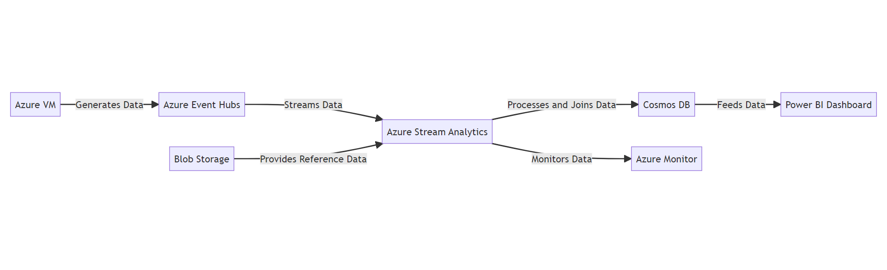

# Azure Stream Analytics for Real-Time Cab Service Monitoring

## Overview
Let's build an end-to-end stream processing pipeline using Azure Stream Analytics for real-time cab service monitoring. By using Azure services such as Azure VM, Docker, Azure Stream Analytics, Azure Event Hubs, Blob Storage, Cosmos DB, and Power BI, the project aims to ingest, analyze, and deliver real-time data insights. The objective is to gain hands-on experience in real-time analytics, event processing, and data visualization using Azure technologies while demonstrating proficiency in building scalable and efficient stream processing pipelines for monitoring and analyzing cab service data.

## Data Pipeline
A data pipeline is a method of moving information from one system to another. The data will be processed in real-time (or streaming) rather than in batches. The data pipeline includes everything from gathering data through multiple ways to storing raw data, cleaning, verifying, and transforming data into a query-able format.

## Tech Stack
- Language: SQL
- Services: Azure VM, Docker, Azure Stream Analytics, Azure Event Hubs, Blob Storage, Cosmos DB, Power BI

## Steps
1. Set up an Azure Resource Group to create and manage the required Azure services.

2. Create an Event Hub as the ingestion point for cab booking/drop ride details.

3. Configure and run a generator code on an Azure VM to simulate real-time data.

4. Use Azure Stream Analytics to join reference data from Blob Storage, such as customer details and cab owner details.

5. Derive insights and trends from the joined data, such as average commission per kilometer and routes with maximum bookings, etc.

6. Store a copy of the data in Cosmos DB for feeding Power BI dashboards.

7. Connect Power BI to the data in Cosmos DB and create visually engaging and interactive dashboards.

8. Implement Azure Monitor to monitor the stream processing pipeline and trigger email notifications to service administrators in case of input overload.

## Architecture Diagram

